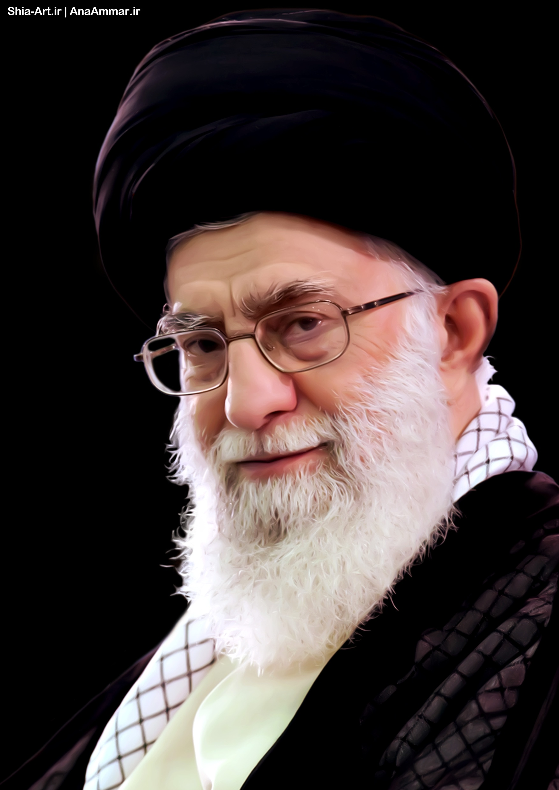
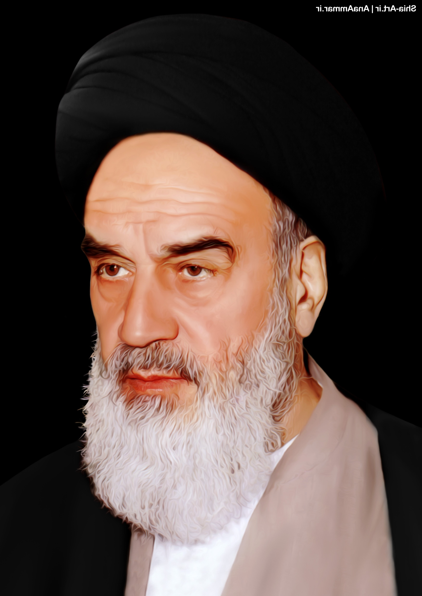

## Dependencies

- Opencv `cv2`
- Matplotlib `matplotlib`
- Numpy `numpy`
- dlib `dlib`

to install dlib python library, you need to have `cmake` installed on your system. you can install `cmake` 
on ubuntu with the following command:

`sudo apt-get install -y cmake`

## Project Definition

todo

## Results

| First Image | Second Image | Image Morphing |
| ------ | ------ | ------ |
|  |  |  |

### Image Processing Course Project
